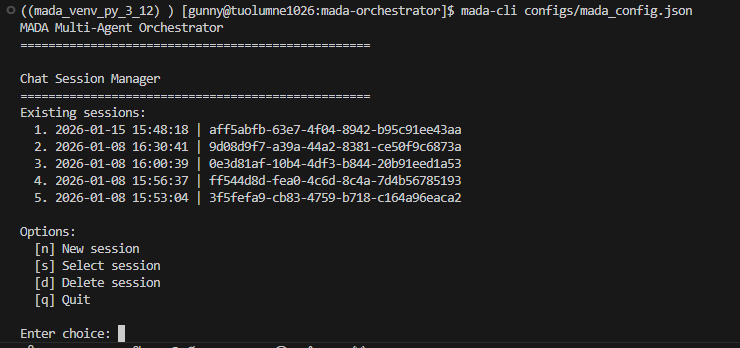
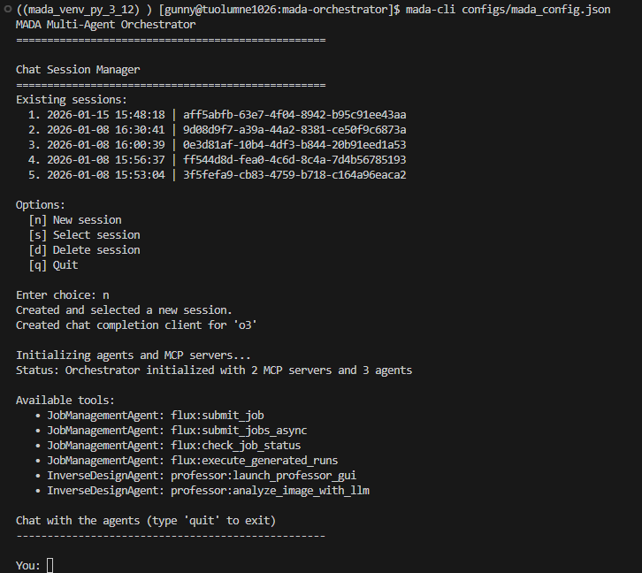
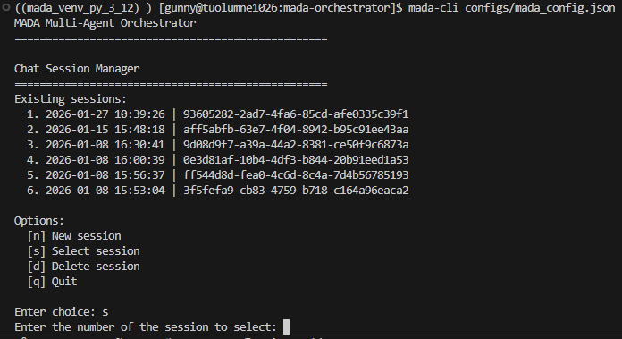
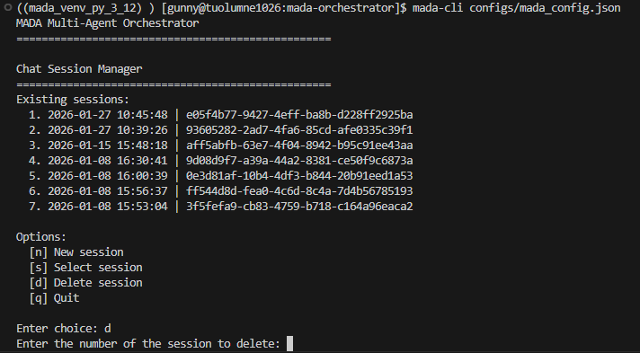

# CLI Mode

## What is CLI Mode?

CLI (Command-Line Interface) mode allows you to run MADA entirely from your terminal or command prompt. In this mode, you interact with agent groups using text-based commands and prompts, making it ideal for users who prefer keyboard-driven workflows or need to operate in environments without graphical support.

## Why Use CLI Mode Over Gradio Mode?

CLI mode may be preferred over Gradio mode for several reasons:

- **Efficiency:** CLI mode is lightweight and consumes minimal resources, making it suitable for remote servers, HPC clusters, or headless systems.
- **Direct Control:** Provides granular control over agent interactions, useful for advanced users and debugging.
- **No Graphical Dependencies:** Perfect for environments where web browsers or GUIs are unavailable or undesirable.

In summary, CLI mode is ideal for users who value speed or are working in terminal-only environments.

## Using CLI Mode

To start MADA in CLI mode, use the following command and specify the configuration file:

```bash
mada-cli configuration.json
```

When you run this command, MADA first shows a session management prompt:



To create a new session, type `n` and press Enter. This creates a new session using the configuration you provided, lists the available tools, then asks you for a prompt to send to the agents:



From here you can continue the conversation for as long as you like.

## Session Management

As described in the [previous section](#using-cli-mode), when you start MADA in CLI mode you first see a session management prompt. In that section we covered how to start a new session; here we describe the other options.

To resume a previous conversation, type `s` and press Enter. You will then be prompted to enter a number from the list of existing sessions:



After you enter a number, the history for that session is loaded so you can pick up where you left off.

To delete a session, type `d` and press Enter at the initial session management prompt shown when you start MADA in CLI mode. As with selecting a session, you will then be prompted to enter a number from the list of existing sessions:


